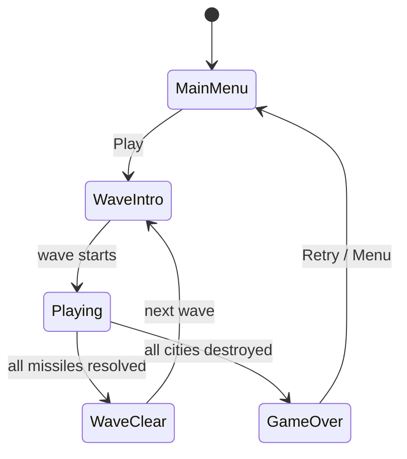
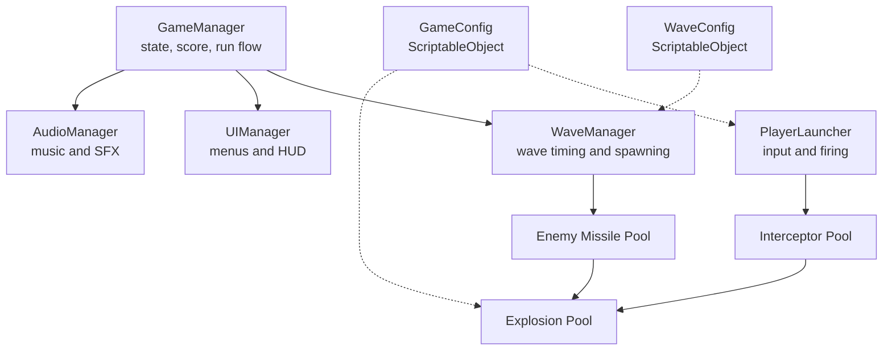

# Game Design Document — *Neon Command*

| | |
|---|---|
| **Working title** | Neon Command |
| **Team** | Keren Hazan |
| **Genre** | Arcade / 2D defense / score-chaser |
| **Target platform** | PC (Windows) + Android |
| **Engine / Unity version** | Unity 6.3 LTS (6000.3.20f1), URP, 2D |
| **Orientation & reference resolution** | Landscape, 1920 × 1080 |
| **Expected session length** | 1–5 minutes |
| **Document version** | v0.1 — 2026-09-09 |

---

## 1. High Concept

Neon Command is an arcade defense game inspired by Missile Command. Enemy missiles fall toward four cities. The player clicks or taps a point in the sky to launch an interceptor that explodes at that location. Explosions destroy nearby missiles and can trigger chain reactions. Survive increasingly difficult waves while keeping at least one city alive.

### Design pillars

1. **Simple controls** — one click or tap selects a target and launches one interceptor. This rules out extra combat buttons, manual movement, or complicated aiming controls.

2. **Readable action** — missile paths, targets and explosion areas are always visible. The player should understand why a missile was destroyed or why a city was hit. This rules out invisible attacks or random instant damage.

3. **Increasing pressure, same rules** — later waves become faster and denser, but the controls and basic rules do not change. Difficulty comes from making better decisions, not learning new controls every wave.

---

## 2. Reference & Inspiration

- **Primary reference:** Atari's *Missile Command* (1980)  
  https://atari.com/pages/missilecommand

- **Gameplay reference:**  
  https://www.youtube.com/watch?v=O-WseYhh1u0

- **Taking:** defending cities from incoming missiles, targeting a point in the sky, interceptor explosions, limited ammunition, wave-based progression, and increasing pressure.

- **Changing:** mouse and touch controls, one central defensive battery, four cities, stronger chain reactions, and a modern neon visual style.

- **Not taking:** the original Atari art or assets, the exact original levels, multiple defensive batteries, or multiplayer.

- **Secondary reference:** *Missile Command: Recharged*. The main inspiration from it is the modern arcade presentation and stronger visual feedback. Power-ups and large progression systems are not planned.

**Visual direction:** a dark background with bright missile trails, simple city silhouettes, glowing circular explosions and strong visual feedback when a missile is destroyed.

---

## 3. Core Game Loop

### Moment-to-moment rules

- Enemy missiles spawn near the top of the screen and travel toward one randomly selected surviving city.
- The player has a limited number of interceptor shots in each wave.
- Clicking or tapping a valid point in the play area launches one interceptor from the central battery toward that point.
- When the interceptor reaches its target, it creates a circular explosion that grows to a maximum radius, stays active briefly, and then disappears.
- Any enemy missile that enters an active explosion is destroyed.
- A destroyed enemy missile creates a smaller secondary explosion. This can destroy another missile and create a chain reaction.
- If an enemy missile reaches its target city, that city is destroyed for the rest of the run.
- A wave ends after all scheduled missiles have spawned and no enemy missiles remain on screen.
- The next wave contains more missiles and/or faster missiles.
- **Failure:** when all four cities have been destroyed, the run ends and the Game Over screen appears.
- **Scoring:** destroying an enemy missile gives points. Chain reactions give increasing bonus points. At the end of a wave, surviving cities and unused interceptor shots give additional bonus points.

### Parameters to tune

| Parameter | What it controls | First guess |
|---|---|---|
| `interceptorSpeed` | How quickly a defensive missile reaches the selected point | 12 u/s |
| `enemyMissileSpeed` | Starting speed of enemy missiles | 2.5 u/s |
| `spawnInterval` | Time between enemy missile spawns | 1.2 s |
| `blastMaxRadius` | Maximum size of a defensive explosion | 1.8 u |
| `blastExpandDuration` | How long an explosion takes to reach full size | 0.25 s |
| `blastHoldDuration` | How long the explosion remains dangerous at full size | 0.2 s |
| `chainBlastScale` | Size of a secondary chain-reaction explosion compared with a normal blast | 0.65 |
| `ammoPerWave` | Number of defensive shots available in a wave | 14 |
| `waveStartDelay` | Short delay before each new wave begins | 1.5 s |

**Where these live:** gameplay values will be exposed through `GameConfig` and `WaveConfig` ScriptableObjects so they can be changed in the Unity Inspector without editing gameplay code.

**Feel target:** a first-time player should understand the tap/click → interceptor → explosion interaction within the first ten seconds and should be able to complete Wave 1 within a few attempts.

---

## 4. Controls & Input

| Action | Keyboard / Mouse | Gamepad | Touch |
|---|---|---|---|
| Aim and launch interceptor | Left-click on a target position | Not planned | Tap a target position |
| Pause | Escape | Not planned | Pause button |
| UI / Play / Retry | Left mouse click | Not planned | Tap button |

- The same gameplay action is used on PC and Android: select a position in the play area.
- A click or tap on a UI button is consumed by the UI and does not also launch an interceptor.
- Input outside the valid gameplay area is ignored.
- The player cannot launch an interceptor while the game is paused, between waves, or after Game Over.
- Touch UI will use anchors and a `CanvasScaler` rather than fixed pixel positions.
- Android will use landscape orientation and the UI will respect the device safe area.

---

## 5. Screens & UI

1. **Main Menu** — game title, Play button and saved Best Score.

2. **Wave Intro** — a short "WAVE X" message before gameplay begins.

3. **Gameplay** — the four cities, central battery and active missiles. The HUD shows current score, current wave, remaining ammunition and a pause button.

4. **Pause** — Resume, Restart and Main Menu buttons.

5. **Wave Clear** — a short results overlay showing the wave number and bonus points before the next wave begins.

6. **Game Over** — final score, best score, Retry button and Main Menu button.

**HUD during play:** score, wave number, ammunition and pause only. There is no minimap, inventory, health bar or upgrade menu.

**Canvas setup:** Screen Space - Overlay, `CanvasScaler` set to **Scale With Screen Size**, reference resolution 1920 × 1080, with important UI elements anchored away from unsafe screen areas.

---

## 6. Art & Audio

The visual style will use simple shapes and effects rather than copied artwork from the original Missile Command.

| Asset | Variants / frames | Source & licence | Use |
|---|---|---|---|
| Enemy missiles | Simple line/sprite + trail | Created in Unity | Incoming threats |
| Interceptors | Simple line/sprite + trail | Created in Unity | Player shots |
| Explosions | Circle + particles | Created in Unity | Missile destruction and chain reactions |
| Cities | 4 simple silhouettes | Original / created for the project | Objects being defended |
| UI | TextMeshPro + simple generated shapes | Unity / project-created | Menus and HUD |
| Sound effects | Launch, explosion, city hit | Planned CC0 source such as Kenney; exact source will be recorded before import | Gameplay feedback |
| Background music | One looping track if time allows | Planned CC0 source; exact source will be recorded before import | Background atmosphere |

**Licence note:** no original Missile Command graphics, sounds or other copyrighted game assets will be copied. Any third-party assets added later will have their source and licence documented before submission. Paid assets are not planned.

**Technical art rules:** gameplay will use a dark background and high-contrast glowing objects. Trails, particles and explosion visuals must remain readable on both PC and a phone screen. Visual effects should not hide incoming missiles.

---

## 7. Technical Design

**Scenes:** one main scene, `Game.unity`. Main Menu, gameplay, Wave Clear and Game Over are different game/UI states rather than separate scenes.

**Packages / systems used:** Unity Input System, Physics2D triggers, URP 2D, Particle System and TextMeshPro.

**Target devices:** Windows 11 PC for development/demo and an Android phone for touch/build testing.

**Performance target:** 60 FPS during gameplay on the target Android device. The Unity Profiler will be used before submission to check CPU and memory behaviour during longer runs.

### Architecture

| Script | Responsibility |
|---|---|
| `GameManager` | Owns MainMenu / Playing / WaveClear / GameOver state, score and run flow |
| `WaveManager` | Starts waves, schedules enemy spawns and detects when a wave is complete |
| `PlayerLauncher` | Reads mouse/touch input and requests an interceptor from the pool |
| `EnemyMissile` | Moves toward a target city and reports arrival or destruction |
| `Interceptor` | Travels toward the selected target point and starts an explosion on arrival |
| `Explosion` | Controls blast growth, collision area and chain reactions |
| `City` | Tracks whether one defended city is still alive |
| `UIManager` | Updates HUD and shows/hides menu panels |
| `AudioManager` | Plays launch, explosion, UI and music audio |
| `GameConfig` | Stores global tunable gameplay values |
| `WaveConfig` | Stores the values for one wave such as missile count, speed and spawn interval |

### Course features implemented

1. **Object Pooling** — enemy missiles, interceptors and explosions are reused instead of constantly calling `Instantiate` and `Destroy`. These objects are created repeatedly during gameplay, so pooling avoids unnecessary runtime allocations and is a natural fit for the game.

2. **Coroutines** — explosion growth/hold/fade and the delays between waves are timed sequences. Coroutines allow these sequences to happen across multiple frames without blocking gameplay.

3. **Singleton** — `GameManager` is the single source of truth for the current game state and score so systems do not create conflicting copies of global game state.

4. **ScriptableObjects** — `GameConfig` and `WaveConfig` hold values that need playtesting and balancing, allowing wave difficulty to be changed in the Inspector without changing gameplay code.

5. **PlayerPrefs** — the best score is saved locally between game sessions.

6. **PC + mobile input** — the same core action works as a mouse click on Windows and a touch on Android. The game will be built and tested as an Android application as well as on PC.

7. **Events** — UI and audio can react to changes such as score, ammunition, city destruction and Game Over without putting presentation code inside the gameplay classes.

---

## 8. Scope

### 8.1 MVP — required for the game to be complete

- [ ] Main Menu → gameplay → Game Over → Retry loop
- [ ] Four cities that can be individually destroyed
- [ ] One central defensive battery
- [ ] Mouse click and Android touch targeting
- [ ] Pooled player interceptors
- [ ] Pooled enemy missiles
- [ ] Expanding defensive explosions
- [ ] Secondary explosions and working chain reactions
- [ ] At least three configurable waves
- [ ] Limited ammunition per wave
- [ ] Score and wave bonuses
- [ ] Best score saved with `PlayerPrefs`
- [ ] Gameplay HUD
- [ ] Basic missile trails and clear hit/explosion feedback
- [ ] Working Windows build
- [ ] Working Android build

### 8.2 Polish — if the MVP is stable

- [ ] Improved explosion particles and neon glow
- [ ] Screen shake on city destruction or large chain reactions
- [ ] Launch, explosion and city-hit sound effects
- [ ] Simple animated feedback for chain-reaction bonuses
- [ ] One additional enemy missile type if time allows

### 8.3 Explicitly out of scope

- Multiplayer or co-op
- Online leaderboards or accounts
- Backend or network services
- Shop, currency or monetization
- Large upgrade or skill system
- Story mode or cutscenes
- 3D gameplay
- Level editor
- Exact recreation of the original Missile Command levels
- More than one main game mode
- iOS release
- Paid third-party assets

---

## Changelog

| Version | Date | Change |
|---|---|---|
| v0.1 | 2026-09-09 | Initial proposal for lecturer approval |
