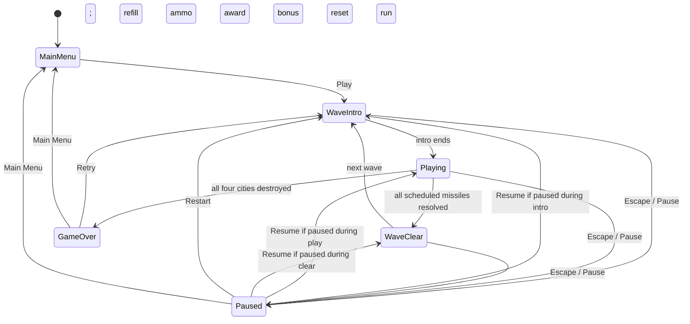
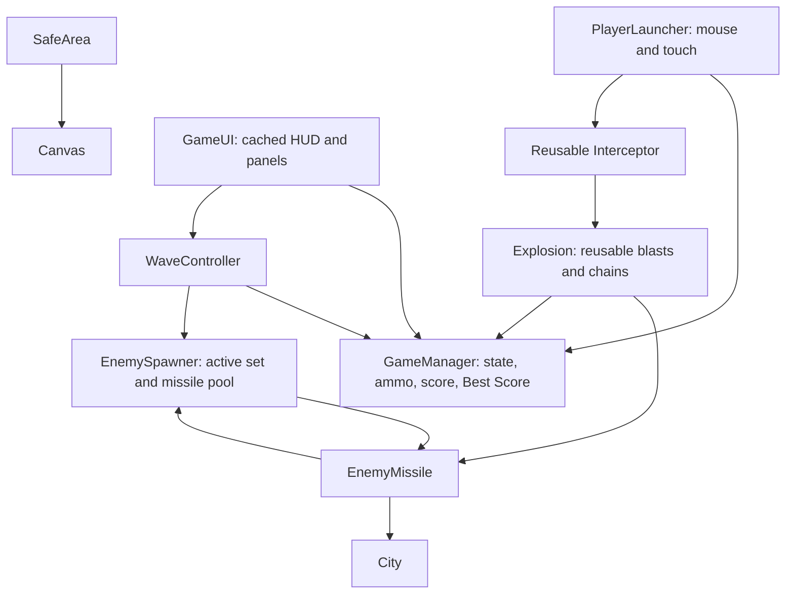

# Game Design Document — *Neon Command*

| | |
|---|---|
| **Title** | Neon Command |
| **Team** | Keren Hazan |
| **Genre** | Arcade / 2D defense / score-chaser |
| **Platforms** | Windows PC + Android |
| **Engine / Unity version** | Unity 6.3 LTS (6000.3.20f1), URP, 2D |
| **Orientation & UI reference resolution** | Landscape, 1920 × 1080 |
| **Document version** | v1.0 — 2026-09-29; implemented MVP |

---

## 1. High Concept

Neon Command is an arcade defense game inspired by Missile Command. Defend four cities by clicking or tapping the sky to launch an interceptor from a central battery. Expanding explosions destroy enemy missiles and create smaller chain explosions. Survive successive waves, conserve ammunition and build a high score while keeping at least one city alive.

### Design pillars

1. **Simple controls** — one screen position selects a target and launches one interceptor. Mouse and primary touch use the same targeting flow.
2. **Readable action** — bright, simple missile and city shapes and circular explosions stand out against a dark background.
3. **Increasing pressure, same rules** — each successive wave adds one missile. Movement speeds and controls remain unchanged.

---

## 2. Reference & Inspiration

- **Primary reference:** Atari's *Missile Command* (1980): https://atari.com/pages/missilecommand
- **Gameplay reference:** https://www.youtube.com/watch?v=O-WseYhh1u0
- **Taking:** city defense, incoming missiles, targeted interceptor explosions, limited ammunition and wave progression.
- **Changing:** one central battery, four cities, mouse/touch targeting, chain scoring and a simple neon-inspired palette.
- **Not taking:** original Atari artwork, sounds, exact levels, multiple batteries or multiplayer.
- **Secondary inspiration:** *Missile Command: Recharged* for its modern arcade presentation. Power-ups and large progression systems are outside this MVP.

The implemented visuals use original lightweight Unity-ready sprites: illuminated city silhouettes, a defensive battery, distinct projectiles, neon explosion rings, a star field and a distant skyline. Trails, particles and audio remain future polish.

---

## 3. Core Game Loop

```mermaid
stateDiagram-v2
    [*] --> MainMenu
    MainMenu --> WaveIntro: Play
    WaveIntro --> Playing: intro ends; refill ammo
    Playing --> WaveClear: all scheduled missiles resolved; award bonus
    WaveClear --> WaveIntro: next wave
    Playing --> GameOver: all four cities destroyed
    WaveIntro --> Paused: Escape / Pause
    Playing --> Paused: Escape / Pause
    WaveClear --> Paused: Escape / Pause
    Paused --> WaveIntro: Resume if paused during intro
    Paused --> Playing: Resume if paused during play
    Paused --> WaveClear: Resume if paused during clear
    Paused --> WaveIntro: Restart; reset run
    Paused --> MainMenu: Main Menu; reset run
    GameOver --> WaveIntro: Retry; reset run
    GameOver --> MainMenu: Main Menu; reset run
```

Pause remembers the previous state and sets `Time.timeScale` to 0. Resume restores that state and time scale 1. Retry and Restart reload `Game.unity` and begin a new Wave 1 intro; Main Menu reloads into the menu. A new run restores four cities and resets score and wave progress, while retaining Best Score.

### Moment-to-moment rules

- Enemy missiles spawn near the top of the camera view, at random viewport X positions between 0.05 and 0.95 and viewport Y 0.95. Each targets a randomly selected living city.
- If a missile's target disappears or is already destroyed, the missile resolves safely and returns to its pool without points or a chain explosion.
- A valid click/tap launches the reusable interceptor from the battery to a world position on Z = 0. Only one interceptor can be in flight at a time.
- Each launch costs one shot. Ammo refills to 10 when each wave enters Playing; unused ammo does not carry over.
- At its target, the interceptor starts a circular explosion and disables itself. The blast grows smoothly, holds at full size briefly, then disables itself for reuse.
- During Playing, a missile entering an explosion's trigger is destroyed. It creates a secondary explosion at its destruction position, which can destroy further missiles and continue the chain.
- Every secondary blast has 65% of the normal maximum radius, including later generations; the radius does not repeatedly shrink with chain depth.
- Explosions affect enemy missiles only. They do not damage cities.
- A missile reaching its target destroys that city for the rest of the run, then returns to its pool. City impacts do not create secondary explosions.
- A wave finishes when all scheduled missiles have spawned and the active missile count reaches zero, provided at least one city survives. Inactive pooled objects do not delay wave completion.
- Wave missile count is `5 + (waveNumber - 1)`: 5, 6, 7, and so on. Spawn interval and missile speed stay constant; there is no fixed final wave.
- When all four cities are destroyed, Game Over stops further wave spawning and player launches.

### Scoring and Best Score

| Event | Points |
|---|---:|
| Missile destroyed by a direct interceptor explosion (generation 0) | 100 |
| Missile destroyed by a chain explosion of generation `g` | `100 + 50 × g` |
| Missile reaches a city or loses its target | 0 destruction points |
| Wave-clear surviving-city bonus | 100 per surviving city |
| Wave-clear unused-ammo bonus | 10 per unused interceptor shot |

Generation scores are 100, 150, 200, and so on. Branches at the same generation award the same amount; this is a generation bonus, not a running kill-count multiplier. Each explosion-caused destruction starts a blast of the next generation. Each missile resolves once, preventing duplicate points and pool returns even when blasts overlap.

The total wave-clear bonus is `100 × survivingCities + 10 × remainingAmmo`, awarded once on entering Wave Clear. For example, four surviving cities and ten unused shots give 500 points. No separate flat wave bonus or accuracy percentage bonus is applied.

`GameManager` owns score and exposes Best Score read-only. It loads `PlayerPrefs` key **`BestScore`** at startup, defaulting to 0. On Game Over, a higher run score updates the key and calls `PlayerPrefs.Save()`. Retry, Main Menu return and subsequent application sessions retain the saved record. Leaving a run through the pause menu does not itself save a new record.

### Current gameplay parameters

These are the current serialized scene/prefab values, adjustable in the Inspector. They are not stored in GameConfig or WaveConfig assets.

| Component / field | Value |
|---|---:|
| `Interceptor.movementSpeed` | 12 units/s |
| `EnemyMissile.movementSpeed` | 2.5 units/s |
| `WaveController.startingMissilesPerWave` | 5 |
| `WaveController.spawnInterval` | 1 second |
| `WaveController.waveIntroDuration` | 1.5 seconds |
| `WaveController.waveClearDuration` | 1.5 seconds |
| `Explosion.maxRadius` | 1.8 units |
| `Explosion.expandDuration` | 0.25 seconds |
| `Explosion.holdDuration` | 0.2 seconds |
| `Explosion.chainBlastScale` | 0.65 (secondary radius: 1.17 units) |
| `GameManager.startingAmmoPerWave` | 10 |
| `PlayerLauncher.minimumTargetY` | -2.5 world units; target must be above this |

---

## 4. Controls & Input

| Action | Windows PC | Android |
|---|---|---|
| Aim and launch | Left-click a target in the sky | Tap a target in the sky |
| Pause / resume | Escape; on-screen Pause / Resume also available | On-screen Pause / Resume |
| Play / Retry / Restart / Main Menu | Left-click the button | Tap the button |

- Unity's Input System handles mouse left-click, primary touch and the Escape key; gameplay does not use the legacy Input API.
- Mouse and touch both call the same screen-position targeting logic. The assigned camera converts screen coordinates into world coordinates.
- Targeting requires Playing, available ammo, an inactive interceptor, a point inside the camera's pixel rectangle and world Y greater than -2.5.
- UI raycasts consume clicks/taps over UI so they do not also launch an interceptor. Launches are blocked in menus, pause, wave transitions and Game Over.
- Android allows both landscape orientations and disables portrait rotation. UI anchors, scaling and safe-area adjustment support different screen shapes.
- Gamepad and keyboard aiming are outside the MVP.

---

## 5. Screens & UI

1. **Main Menu** — title, Play button and persistent Best Score.
2. **Wave Intro** — a timed “WAVE X” overlay before spawning and firing begin.
3. **Playing** — HUD shows score, current wave, remaining ammo and Pause.
4. **Pause** — Resume, Restart and Main Menu. Pauses missile movement, explosion timing and wave timing.
5. **Wave Clear** — wave number and total bonus, followed by the next wave intro.
6. **Game Over** — final score, Best Score, Retry and Main Menu.

`GameUI` reads public game state and caches displayed values, refreshing text when values change and panels when the state changes. Buttons use Unity UI `onClick` listeners.

The Canvas uses Screen Space - Overlay, **Scale With Screen Size**, a **1920 × 1080** reference resolution and **0.5** width/height match. HUD and panel elements use anchors. `SafeArea` adjusts the UI container to `Screen.safeArea` when the screen or safe area changes. The scene has one EventSystem using `InputSystemUIInputModule`.

---

## 6. Art & Audio

The MVP uses simple, high-contrast shapes on a dark blue/black background.

| Asset | Implemented presentation | Source |
|---|---|---|
| Enemy missiles | Small bright pink sprites | Unity built-in shapes |
| Interceptor | Simple contrasting sprite | Unity built-in shape |
| Explosions | Expanding cyan circular visual and matching trigger area | Unity shape |
| Cities / battery | Four cyan illuminated city silhouettes and a central launcher battery | Original project artwork |
| UI | TextMeshPro text, simple colored buttons and dark panels | Unity UI and TextMeshPro Essential Resources |
| Sound effects / music | Not implemented | No gameplay audio assets added |

Missile trails, particles, animated bonus feedback, screen shake and audio are future polish. The current artwork provides neon silhouettes, distinct projectiles, a star field, skyline depth and ring-based explosion feedback; explosions disable after holding rather than fading out.

No original Missile Command graphics or sounds are used. Any future third-party art or audio needs its source and licence recorded when added.

---

## 7. Technical Design

**Scene and platforms:** `Assets/Scenes/Game.unity` is the enabled build scene; SampleScene is disabled. The game opens into Main Menu within Game.unity. Windows PC and Android landscape share the same gameplay and UI.

**Systems used:** URP 2D, Physics2D triggers, Unity Input System, Unity UI, TextMeshPro, coroutines and PlayerPrefs. Enemy missiles move in script; a kinematic Rigidbody2D and BoxCollider2D support trigger interactions with the growing CircleCollider2D on explosions.

**Performance:** `GameManager.Awake()` sets `QualitySettings.vSyncCount = 0` and `Application.targetFrameRate = 60`. This is a frame-rate target, not a measured guarantee on every Android device. Enemy missiles and explosions reuse inactive instances; the interceptor is a single reusable object. Pools grow when all existing instances are busy and belong to the current scene/run.

### Architecture

```mermaid
graph TD
    GM[GameManager: state, ammo, score, Best Score]
    WC[WaveController] --> GM
    WC --> ES[EnemySpawner: active set and missile pool]
    ES --> EM[EnemyMissile]
    EM --> C[City]
    EM --> ES
    PL[PlayerLauncher: mouse and touch] --> GM
    PL --> I[Reusable Interceptor]
    I --> EX[Explosion: reusable blasts and chains]
    EX --> EM
    EX --> GM
    UI[GameUI: cached HUD and panels] --> GM
    UI --> WC
    SA[SafeArea] --> Canvas
```

| Script | Responsibility |
|---|---|
| `GameManager` | State transitions, ammo, scoring, wave bonus, persistent Best Score and scene reloads |
| `WaveController` | Wave intro/clear delays, finite spawn schedule and active-missile completion check |
| `EnemySpawner` | Living-city selection, camera-relative spawn position, active missile set and reusable missile stack |
| `EnemyMissile` | Target movement, city impacts, once-only resolution and return to its spawner |
| `PlayerLauncher` | Shared mouse/touch targeting, UI/area checks, ammo use and resetting the interceptor to the battery |
| `Interceptor` | Target movement, explosion request on arrival and self-deactivation |
| `Explosion` | Smooth growth/hold coroutine, missile triggers, generation scoring and reusable secondary blasts |
| `City` | Alive/destroyed state and sprite visibility |
| `GameUI` | Cached text, state panels and button listeners |
| `SafeArea` | Responsive safe-area anchors |

### Implemented technical features

- **Object reuse:** EnemySpawner takes inactive missiles from a stack and creates one only when none are available. Launch resets target, owner, position, resolution flag, renderer/collider enablement and Rigidbody2D motion state. A HashSet tracks active missiles; removal succeeds once before returning an object to the pool. Explosion reuses inactive blasts, and PlayerLauncher reuses the existing Interceptor.
- **Coroutines:** wave delays and explosion growth/hold run over multiple frames using scaled time, so pause freezes them.
- **PlayerPrefs:** local Best Score persistence under `BestScore`.
- **PC/mobile input and UI:** shared targeting, Input System UI, responsive Canvas and safe-area support.
- **Explicit references:** one scene GameManager owns game state. It is not a Singleton implementation. The project uses Inspector references and cached UI polling, not a custom gameplay event bus.

`GameConfig`, `WaveConfig`, separately authored wave assets, `AudioManager`, a Singleton pattern and a custom gameplay event system from the initial proposal are not implemented and are outside this final MVP. Values live in serialized component fields; Unity Button callbacks remain in use.

### Build and validation scope

Use Unity **6000.3.20f1**. Android builds are generated locally under `Builds/Android/` (for example, `NeonCommand.apk`). `Builds/` and APK/AAB files are ignored by Git and must not be committed.

Repository settings and code establish platform support; they do not certify that a locally generated build contains the latest commit or that device performance testing is complete. Final Windows/Android build execution and physical Android touch/performance checks are separate validation work, not additional gameplay features.

---

## 8. Scope

### 8.1 Implemented MVP

- Main Menu, Wave Intro, Playing, Wave Clear, Pause, Game Over and Retry/Main Menu flow.
- Four individually destructible cities and one central defensive battery.
- Mouse targeting, primary touch targeting, Escape and on-screen pause controls.
- One reusable interceptor, pooled enemy missiles and reusable expanding explosions.
- Secondary chain explosions, increasing generation scores and wave-clear bonuses.
- Successive waves with 5, 6, 7, ... missiles and limited ammo refilled per wave.
- Persistent Best Score, cached HUD, responsive UI and Android safe-area handling.
- Windows PC support and Android landscape configuration, with a 60 FPS target.

### 8.2 Future polish — not implemented

- Missile trails, explosion particles, animated bonus feedback, screen shake and enhanced glow.
- Screen shake and animated chain-bonus feedback.
- Launch, explosion and city-hit sounds; optional background music.
- An additional enemy missile type.

### 8.3 Explicitly out of scope

- Multiple concurrent player interceptors or multiple defensive batteries.
- ScriptableObject configuration assets, a Singleton refactor and a custom gameplay event system.
- Multiplayer/co-op, online leaderboards/accounts or backend services.
- Shops, currencies, monetization, power-ups or large progression systems.
- Story/cutscenes, 3D gameplay or a level editor.
- Exact recreation of original Missile Command assets or levels.
- Additional main game modes, iOS release or paid third-party assets.

---

## Changelog

| Version | Date | Change |
|---|---|---|
| v0.1 | 2026-09-09 | Initial proposal for lecturer approval |
| v1.0 | 2026-09-29 | Synced to the implemented MVP: final flow, values, scoring, persistence, reuse, UI and scope |
